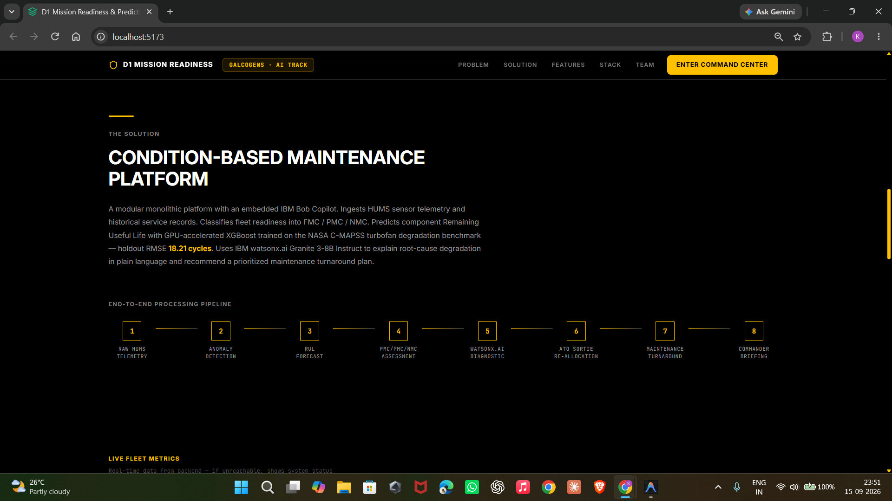

# Application Screenshots — D1 Mission Readiness Copilot

This directory contains real operational screenshots of the **D1 Mission Readiness & Predictive Maintenance Copilot** running with live database telemetry, physics-informed mission stress simulations, and watsonx.ai / IBM Bob integration.

---

## Screenshot Gallery & Operational Walkthrough

### 1. `01-home-dashboard.png` — Tactical Command Dashboard & Fleet Airworthiness Strip

- **Operational View**: Main Command Dashboard showing real-time fleet health across combat squadrons.
- **Key Elements Displayed**:
  - **Fleet Airworthiness KPIs**: Real-time breakdown of **FMC** (Fully Mission Capable), **PMC** (Partially Mission Capable), and **NMC** (Non-Mission Capable) platforms with target benchmark rates.
  - **Live HUMS Stream & MCP Indicator**: Real-time health indicator showing active telemetry ingestion and 11 connected FastMCP tools.
  - **Active Sortie Horizon**: 48-hour mission launch window showing required vs. available airframes and shortfall alerts.
  - **Critical Platform Triage**: Immediate visibility into grounded platforms (e.g. F16-VIPER-101) with degraded subsystem indicators.

---

### 2. `02-query-input.png` — IBM Bob FastMCP Copilot & Environmental Stress Simulator

- **Operational View**: Conversational interaction with the embedded IBM Bob Copilot alongside the Digital Twin What-If Mission Stress Simulator.
- **Key Elements Displayed**:
  - **IBM Bob Conversational Drawer**: Direct natural-language query interface interacting with the backend via FastMCP (`/mcp`), synthesizing fleet status and running diagnostics.
  - **Environmental Stress Twin**: Multi-parameter simulation interface allowing operators to select combat theaters (Desert Heat 45°C, Sand/Dust Ingestion, Sub-Zero Arctic, and 9G Combat Air Maneuvering).
  - **Accelerated Degradation Calculations**: Instant wear multiplier ($K_{env}$) and mission survivability probability computed before committing an airframe to a sortie.

---

### 3. `03-result-output.png` — Digital AFTO Form 781A & Mission Sortie Re-allocation Matrix

- **Operational View**: Official defense maintenance discrepancy dispatching and dynamic Air Tasking Order (ATO) matching.
- **Key Elements Displayed**:
  - **Official AFTO Form 781A Compliance**: Digital representation of Air Force Technical Order Form 781A discrepancy sheet with Red X grounding symbols and Red Diagonal warning markers.
  - **Military Standard Metadata**: Automated Job Control Numbers (JCN), military corrective J-codes, discrepancy narratives, and Defense Logistics Agency (DLA) National Stock Number (NSN) parts requisitions.
  - **Mission-Adaptive Sortie Re-allocation**: Dynamic ATO matching recommendations showing compatible secondary mission profiles (Combat Air Patrol vs Reconnaissance ISR vs Tactical Ferry) for degraded PMC assets, preventing mission cancellations.

