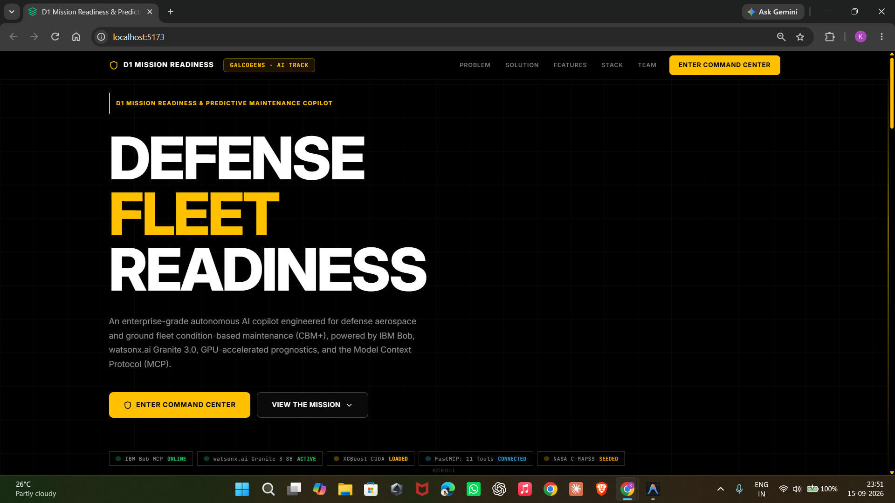
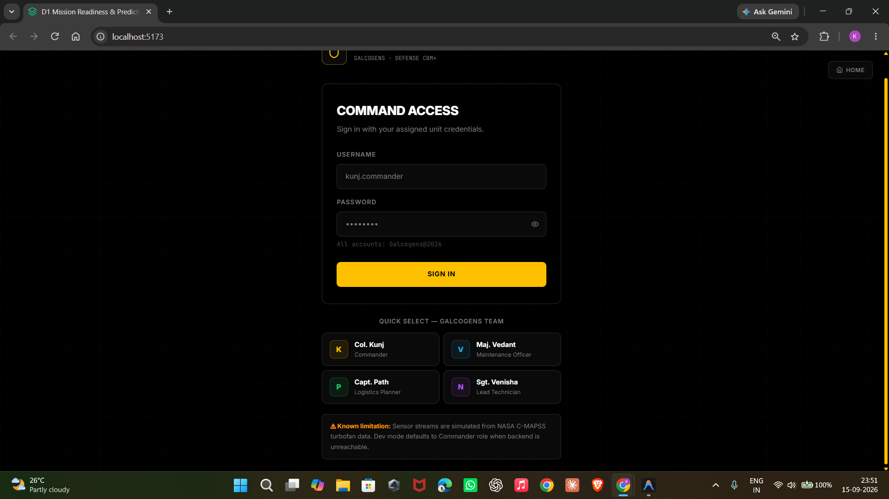
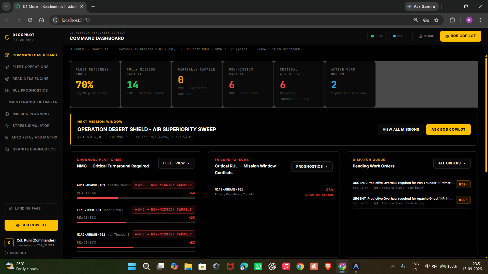
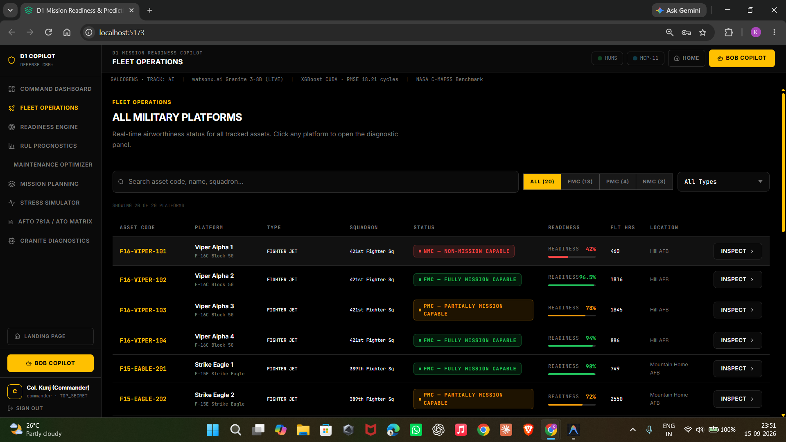
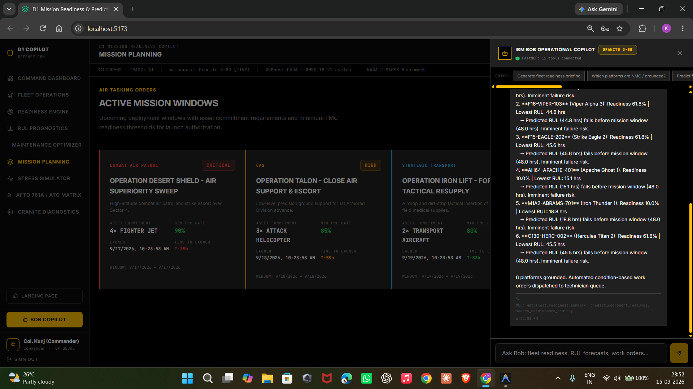

# Application Screenshots - D1 Mission Readiness Copilot

This directory contains real operational screenshots of the D1 Mission Readiness and Predictive Maintenance Copilot running with live database telemetry, physics-informed mission stress simulations, and watsonx.ai / IBM Bob integration.

---

## Screenshot Gallery

### 1. screenshot-1.png - Tactical Command Dashboard

### 2. screenshot-2.png - Detailed Asset Diagnostics

### 3. screenshot-3.png - Predictive Degradation Timeline

### 4. screenshot-4.png - Mission Stress Simulator

### 5. screenshot-5.png - IBM Bob AI Chatbot Integration

### 6. screenshot-6.png - Mission-Aware Maintenance Optimizer

