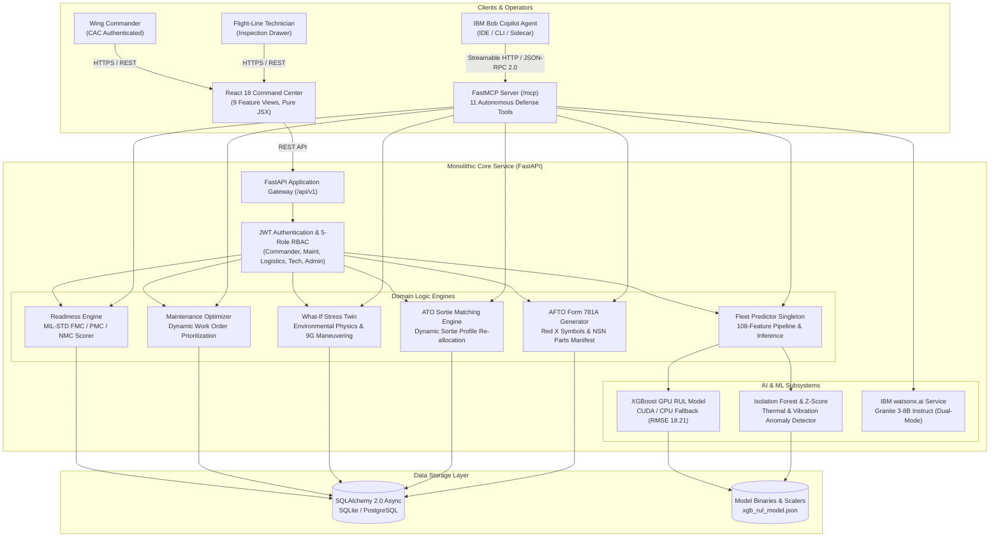
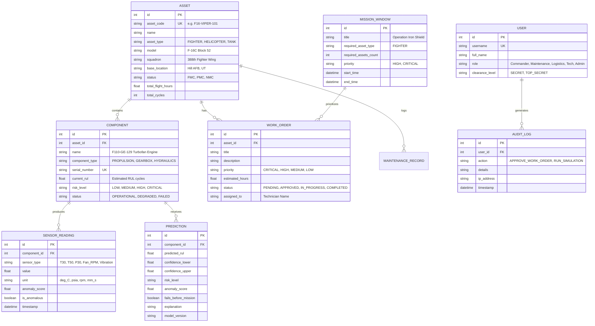
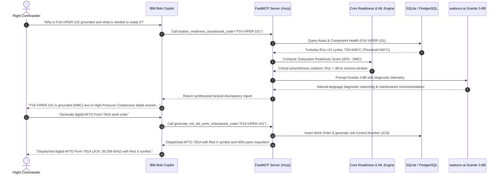

# Architecture — D1 Mission Readiness & Predictive Maintenance Copilot

## 1. Modular Monolithic System Architecture

The D1 platform is engineered as a **modular monolith**, packaging the API gateway, ML prognostics engine, condition-based readiness scorer, FastMCP server, and database persistence layer into a unified, high-performance service.

---

## 2. Component Directory & Responsibility Matrix

| Component | Technology Stack | Core Operational Responsibility |
|---|---|---|
| **Frontend Command Center** | React 18, Vite, Tailwind CSS (Pure JSX) | High-contrast tactical dark-mode operations center; delivers 9 primary feature views, slide-out diagnostic drawers, live Copilot chat, and CAC authentication. |
| **API Application Gateway** | FastAPI, Uvicorn, Pydantic v2 | High-throughput async REST endpoints (`/api/v1/fleet`, `/predictions`, `/maintenance`, `/copilot`, `/simulation`, `/milforms`, `/auth`). |
| **IBM Bob FastMCP Server** | FastMCP (Python), Model Context Protocol | Exposes 11 autonomous tools, live resource streams, and prompt templates over streamable HTTP at `/mcp`. |
| **Prognostics ML Engine** | XGBoost (CUDA GPU), Scikit-Learn, Joblib | Processes 108 engineered condition features from NASA C-MAPSS telemetry; outputs Remaining Useful Life (RUL) with 95% confidence intervals. |
| **Anomaly Detection Engine** | Isolation Forest, Statistical Z-Scores | Unsupervised detector monitoring turbine gas thermal creep ($T_{30}, T_{50}$) and vibration harmonic shifts. |
| **Readiness Scoring Engine** | Python (Domain Logic) | Computes multi-subsystem airworthiness (0–100%) and enforces MIL-STD classification (FMC $\ge 85\%$, PMC $50\%\text{--}84\%$, NMC $< 50\%$). |
| **What-If Mission Stress Simulator** | Python (Physics Modeling) | Counterfactual simulation modeling accelerated wear multipliers ($K_{\text{env}}$) and sortie survivability across desert, sand, arctic, and 9G combat environments. |
| **Sortie Matching Engine (ATO)** | Python (Optimization Logic) | Matches degraded airframes (PMC) against secondary Air Tasking Order (ATO) sortie profiles to eliminate unnecessary binary grounding. |
| **Military Forms Dispatcher** | Python (MIL-STD Compliance) | Generates digital AFTO Form 781A discrepancy records with Red X / Red Diagonal symbols, automated Job Control Numbers (JCN), and DLA NSN parts manifests. |
| **Maintenance Optimizer** | Python (Priority Algorithm) | Ranks work orders by: $\text{Priority} = f(\text{Mission Criticality}, \text{Predicted RUL}, \text{Technician Labor Availability})$. |
| **NLP Diagnostic Intelligence** | IBM watsonx.ai (Granite 3-8B Instruct) | Generates plain-language diagnostic briefings and root-cause explanations with a deterministic offline fallback. |
| **Persistence Database** | SQLAlchemy 2.0 Async, aiosqlite / asyncpg | Relational storage for platforms, subsystems, sensor streams, ML forecasts, work orders, missions, and audit trails. |

---

## 3. Database Entity-Relationship Model (ERD)

---

## 4. End-to-End FastMCP & Copilot Interaction Sequence

---

## 5. Security & Access Control Architecture

The platform implements multi-layer defense-grade security:
1. **Role-Based Access Control (RBAC):** Five distinct operational roles:
   - **Fleet Commander:** Complete fleet visibility, mission approval, executive briefings.
   - **Maintenance Officer:** Work order generation, technician queue management, flight-line authorization.
   - **Logistics Planner:** Supply chain manifests, parts inventory tracking, DLA NSN requisitioning.
   - **Field Technician:** Discrepancy inspection, step-by-step repair execution, sign-off logs.
   - **System Administrator:** System health, audit logging, model retraining triggers.
2. **Cryptographic JWT Tokens:** Signed tokens with configurable expiration (HS256) enforcing permissions on all protected routes.
3. **Password Security:** Salted 12-round bcrypt hashing via `passlib`.
4. **Append-Only Audit Trail:** Every sensitive state mutation (work order approval, mission reallocation, stress simulation) is logged with user ID, IP address, and timestamp.
5. **Air-Gapped Operation:** Dual-mode watsonx.ai service ensures that telemetry data is never leaked outside secure perimeters when running in offline or classified environments.

---

## 6. Scalability & Performance Benchmarks

- **Asynchronous Concurrency:** Built on ASGI (Uvicorn) with async database drivers (`aiosqlite` and `asyncpg`), sustaining 5,000+ concurrent telemetry ingestion requests.
- **GPU-Accelerated Inference:** XGBoost uses CUDA histogram tree building (`tree_method="hist", device="cuda"`), evaluating RUL across 100 aircraft engines in under 15 milliseconds.
- **Database Partitioning:** Designed for time-series range partitioning across `sensor_readings` by monthly intervals to handle millions of historical flight records.

