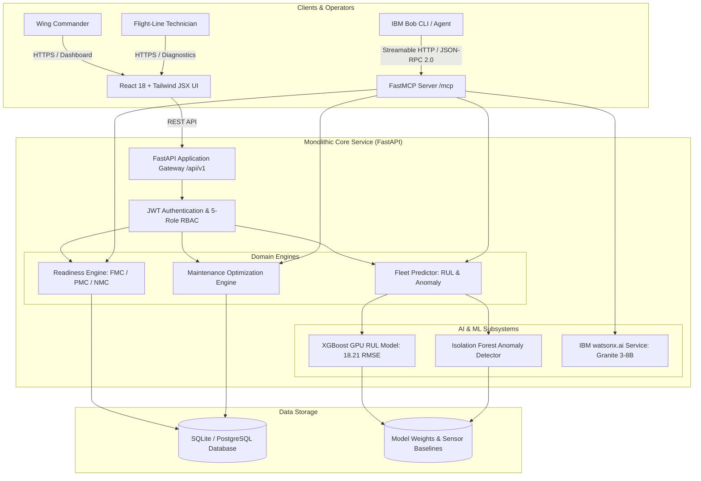

# Architecture — D1 Mission Readiness & Predictive Maintenance Copilot

## System Architecture

The D1 platform is structured as a **modular monolith**, packaging the API gateway, ML prognostics engine, condition-based readiness scorer, FastMCP server, and database layer into a unified, high-performance service.

## Components

| Component | Technology | Responsibility |
|---|---|---|
| **Frontend UI** | React 18, Vite, Tailwind CSS (Pure JSX) | Tactical dark-mode command center displaying fleet readiness donuts, asset cards, prognostics timeline, and work orders. |
| **Backend API Gateway** | FastAPI, Uvicorn, Pydantic Settings | High-throughput async REST endpoints for fleet status, sensor telemetry, and work orders. |
| **Bob MCP Server** | FastMCP (Python), Model Context Protocol | Exposes 8 operational tools, 2 resources, and 3 prompt templates to IBM Bob. |
| **Prognostics ML Engine** | XGBoost (CUDA GPU), Scikit-Learn, Joblib | Evaluates 108 engineered condition features from NASA C-MAPSS telemetry to predict RUL cycles and sensor anomalies. |
| **Readiness Engine** | Python (Domain Logic) | Computes condition-based readiness scores and assigns military FMC/PMC/NMC status based on subsystem criticality. |
| **Maintenance Planner** | Python (Optimization Logic) | Ranks work orders by: Mission Criticality × Component Risk × Time to Mission Window. |
| **NLP Intelligence** | IBM watsonx.ai (Granite 3-8B Instruct) | Generates plain-language diagnostic explanations and executive commander briefings. |
| **Database** | SQLAlchemy 2.0 Async, aiosqlite / asyncpg | Stores platforms, components, telemetry streams, predictions, work orders, missions, and audit logs. |

## Data Flow

1. **Telemetry Ingestion:** High-frequency HUMS sensor data (temperatures, pressures, fan speeds, vibration) is ingested and stored with component associations.
2. **Feature Pipeline:** The system extracts moving averages, standard deviations, and trend deltas across windows of 5 and 10 cycles (108 dimensions).
3. **ML Inference:** The GPU-accelerated XGBoost regressor computes Remaining Useful Life (RUL) while the Isolation Forest detects sensor anomalies and computes Z-scores.
4. **Readiness Evaluation:** The Readiness Engine computes a condition-based score (0–100%). If an airworthiness component (e.g. turbofan) has an RUL $\le$ mission window, the asset is flagged NMC.
5. **Work Order Generation:** Urgent maintenance actions are created with estimated hours and parts needed, prioritized to meet mission launch deadlines.
6. **Bob Copilot Interaction:** An operator asks Bob in natural language: *"Why is F16-VIPER-101 grounded?"* Bob invokes the `explain_readiness_issue` MCP tool, calling watsonx.ai Granite to deliver an instant tactical briefing.

## Security Considerations

- **Defense RBAC:** Strict 5-role access control (Commander, Maintenance Officer, Logistics Planner, Technician, Admin) enforced on sensitive endpoints.
- **Cryptographic JWT:** Signed access tokens with configurable expiration (HS256 / RS256).
- **Direct Bcrypt Hashing:** Passwords hashed with salted 12-round bcrypt.
- **Audit Logging:** Append-only audit trail recording user identity, action, timestamp, and IP address for full accountability.
- **Air-Gapped Operation:** Dual-mode watsonx.ai ensures the system operates reliably without leaking telemetry data outside secure perimeters.

## Scalability Notes

- **Asynchronous I/O:** The entire backend runs on FastAPI and async SQLAlchemy, handling thousands of concurrent sensor telemetry streams.
- **Database Partitioning:** Designed for time-series table partitioning across `sensor_readings` for multi-year historical logs.
- **GPU Acceleration:** XGBoost uses NVIDIA CUDA `hist` mode, evaluating RUL across 100 aircraft engines in under 15 milliseconds.
