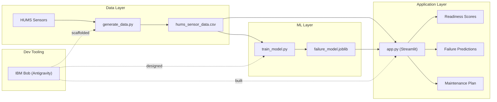

# Architecture

## System Diagram

## Component Descriptions

### Data Layer

| Component           | File                | Purpose                                      |
|---------------------|---------------------|----------------------------------------------|
| Data Generator      | `generate_data.py`  | Creates synthetic HUMS sensor readings       |
| Dataset             | `hums_sensor_data.csv` | 1000 rows across 25 assets, CSV format    |

The generator uses numpy's random number generation with a fixed seed for
reproducibility. A deterministic failure pattern is injected so the model has
a learnable signal.

### ML Layer

| Component       | File              | Purpose                                        |
|-----------------|-------------------|------------------------------------------------|
| Trainer         | `train_model.py`  | Trains and evaluates a RandomForestClassifier  |
| Saved Model     | `failure_model.joblib` | Serialised model for inference            |

The model uses scikit-learn exclusively. No custom ML code is written -- training,
evaluation, and serialisation all use library calls.

### Application Layer

| Component            | File     | Purpose                                       |
|----------------------|----------|-----------------------------------------------|
| Streamlit Dashboard  | `app.py` | Interactive UI with three tabbed views        |

The dashboard loads the CSV and model at startup (cached), computes per-asset
failure probabilities, and presents readiness scores, a failure chart, and a
prioritised maintenance plan with explainability.

### Dev Tooling

IBM Bob (Antigravity) is shown with dashed arrows because it is a development-
time dependency, not a runtime one. Bob was used in Agent mode to write every
source file and in Plan mode to design the architecture before implementation.
