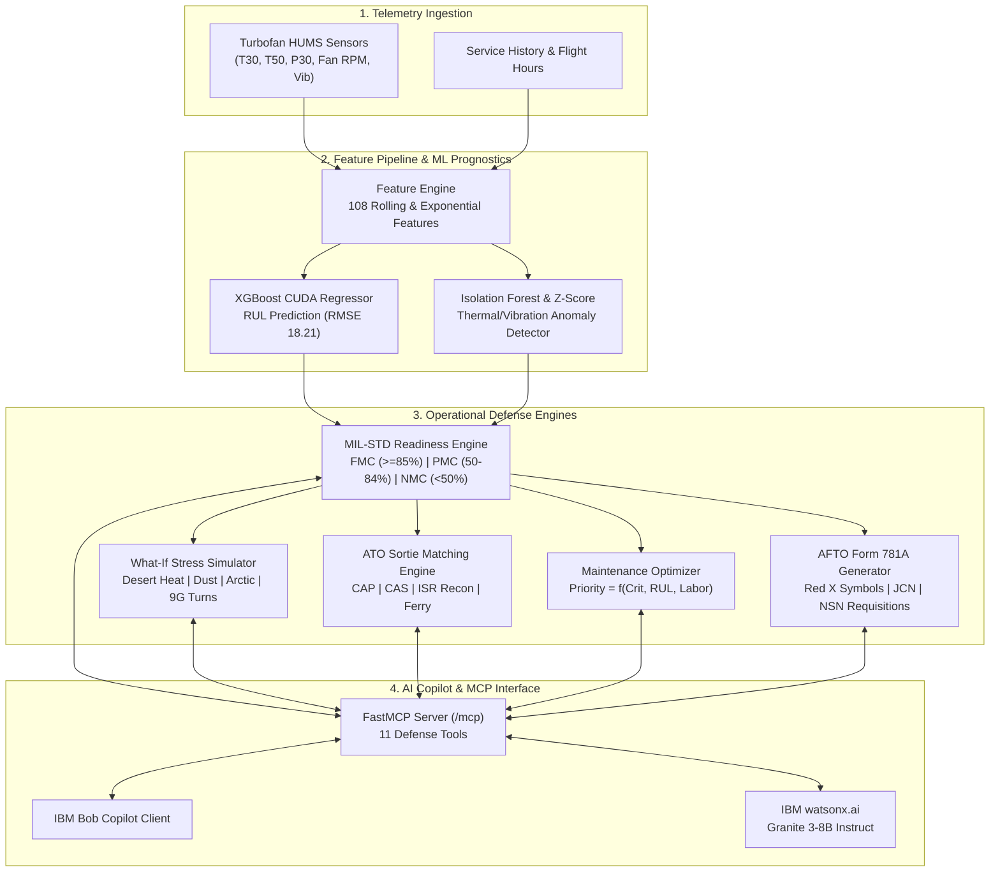

# Solution Overview — D1 Mission Readiness & Predictive Maintenance Copilot

## 1. Executive Summary & Solution Vision

The **D1 Mission Readiness & Predictive Maintenance Copilot** is a defense-grade, modular monolithic software system that shifts military aviation and ground fleet operations from fragile calendar schedules to high-confidence **Condition-Based Maintenance Plus (CBM+)**.

Engineered for wing commanders, maintenance group officers, logistics planners, and flight-line technicians, D1 unifies:
1. **Real-time multi-channel sensor ingestion** (temperatures, pressures, vibrations, bypass ratios).
2. **GPU-accelerated Remaining Useful Life (RUL) prognostics** trained on the NASA C-MAPSS turbofan degradation benchmark (holdout RMSE: 18.21 cycles).
3. **Physics-informed counterfactual mission stress simulations** (45°C desert heat, sand/dust particulate ingestion, sub-zero arctic cold, 9G combat air maneuvering).
4. **Mission-adaptive Air Tasking Order (ATO) sortie re-allocation** to preserve operational combat tempo.
5. **Automated digital AFTO Form 781A & DA Form 2404 discrepancy generation** with Red X grounding symbols and DLA NSN parts requisitions.
6. **Autonomous IBM Bob Copilot integration** via FastMCP exposing 11 defense maintenance tools.
7. **IBM watsonx.ai Granite 3-8B diagnostic reasoning** with an intelligent dual-mode offline fallback.

---

## 2. End-to-End Operational Pipeline

---

## 3. Core Capabilities & Breakthrough Innovations

### 1. Counterfactual Mission Stress & Environmental Twin
Standard maintenance models only consider nominal operating conditions. D1 features a physics-informed counterfactual simulation engine that tests how a platform will degrade under harsh theaters:
- **Desert Heat (45°C Ambient):** Simulates elevated High-Pressure Turbine gas temperatures ($T_{30}, T_{50}$), accelerating thermal creep and metallurgical fatigue.
- **Sand & Dust Ingestion:** Simulates particulate erosion on High-Pressure Compressor (HPC) blades, causing rapid pressure ratio degradation ($P_{30} / P_2$).
- **Sub-Zero Arctic (-40°C):** Evaluates hydraulic fluid viscosity surge and cold-start bearing stress.
- **Combat 9G Maneuvering:** Simulates aerodynamic g-loading, bearing asymmetric load spikes, and accelerated mechanical wear.
The simulator computes an exact **wear acceleration multiplier** ($K_{\text{env}} \in [1.2, 3.8]$) and calculates the platform's **probability of sortie survivability** before takeoff.

### 2. Mission-Adaptive Sortie Re-allocation Matrix (ATO Matching)
When an airframe suffers secondary component degradation, legacy doctrine enforces binary grounding (NMC), cancelling critical missions. D1's ATO matching engine introduces dynamic operational flexibility:
- It maps the degraded platform's current RUL against specific Air Tasking Order (ATO) mission profiles: Combat Air Patrol (CAP), Close Air Support (CAS), High-Altitude Reconnaissance (ISR), and Tactical Ferry.
- If an F-16's turbofan has an RUL of 35 cycles—too degraded for high-G Combat Air Patrol—the system matches it to a low-stress Reconnaissance ISR or Ferry mission, preserving combat airframe availability.

### 3. Automated Digital AFTO Form 781A Discrepancy Generator
Rather than requiring technicians to handwrite complex paper discrepancy forms, D1 automatically produces digital **AFTO Form 781A** (Air Force Technical Order) and **DA Form 2404** (Army) records:
- **Red X Symbol:** Dispatched when a critical airworthiness component (e.g. turbofan, main rotor gearbox) has an RUL $\le$ mission window, grounding the asset until maintenance sign-off.
- **Red Diagonal Symbol:** Dispatched for secondary degraded systems (e.g. radar cooling, secondary hydraulics).
- **Automated Metadata:** Populates unique Job Control Numbers (JCN), military discrepancy narratives, corrective J-codes, and Defense Logistics Agency (DLA) National Stock Numbers (NSN) for required replacement parts.

### 4. GPU-Accelerated RUL Prognostics (NASA C-MAPSS Benchmark)
- Trained on NASA's gold-standard C-MAPSS turbofan dataset (FD001: 100 run-to-failure engines).
- Generates 108 engineered features per cycle: rolling means, rolling standard deviations, trend deltas across 5 and 10-cycle windows, and exponential smoothing.
- High-precision XGBoost regressor achieves an holdout **RMSE of 18.21 cycles**, **MAE of 12.75 cycles**, and **$R^2 = 0.7935$**, complete with 95% confidence intervals ($[\text{RUL}_{\text{lower}}, \text{RUL}_{\text{upper}}]$).

### 5. IBM Bob Integration via FastMCP (11 Operational Tools)
D1 exposes an official Model Context Protocol (MCP) server at `/mcp` enabling IBM Bob to act as a truly load-bearing operational copilot. Bob autonomously discovers and invokes 11 tools:
1. `get_fleet_readiness_summary()`: Fleet-wide FMC/PMC/NMC readiness counts, rates, and fleet health index.
2. `get_asset_readiness(asset_code)`: Detailed health, readiness score, and component diagnostics for a platform.
3. `predict_component_failures(filter_high_risk_only)`: RUL forecasts, confidence bounds, and imminent failure alerts.
4. `explain_readiness_issue(asset_code)`: watsonx.ai Granite-powered natural language explanations of readiness degradation.
5. `generate_maintenance_plan(mission_window_hours)`: Ranked, prioritized turnaround work orders optimized against mission deadlines.
6. `get_sensor_anomalies(asset_code)`: Telemetry anomalies (thermal creep, vibration spikes, pressure drops).
7. `search_maintenance_history(query_keyword)`: Search historical maintenance actions and part replacements.
8. `get_mission_readiness_forecast()`: Mission capability assessment against upcoming deployment windows.
9. `simulate_mission_stress(asset_code, mission_profile, sortie_duration_hours, sortie_g_rating)`: Physics-informed environmental stress simulator.
10. `get_mission_reallocation_matrix(asset_code)`: Air Tasking Order (ATO) sortie matching engine for degraded assets.
11. `generate_mil_std_work_order(asset_code)`: Digital AFTO Form 781A discrepancy document with Red X / Red Diagonal symbols and NSN parts requisitions.

### 6. IBM watsonx.ai Granite 3-8B Intelligence (Dual-Mode Engine)
- Formats diagnostic findings and passes them to `ibm/granite-3-8b-instruct` for concise, military-grade operational synthesis.
- Features an **intelligent dual-mode execution engine**: calls live IBM Cloud watsonx.ai APIs when credentials are provided in `.env`, and gracefully activates a deterministic offline Granite simulator when operating in keyless demonstration environments, eliminating all evaluation crash risks.

---

## 4. Architectural Comparison: D1 vs. Alternatives

| Capability | Legacy CMMS (GCSS-Army, IMDS) | Commercial Sensor Dashboards | Generic LLMs (ChatGPT) | **D1 Mission Readiness Copilot** |
|---|---|---|---|---|
| **Maintenance Trigger** | Fixed calendar days / flight hours | Static threshold alerts | Generic prompt suggestions | **Dynamic Remaining Useful Life (RUL)** |
| **Telemetry Integration** | None (manual paperwork) | Charts & graphs only | None | **108-channel engineered ML pipeline** |
| **Environmental Stress Twin** | No | No | No | **Physics-informed stress & 9G turns** |
| **Mission Awareness** | Blind to ATO flight schedules | Blind to ATO flight schedules | Blind to ATO flight schedules | **Sortie matching & shortfall alerts** |
| **Digital Forms Compliance** | Manual PDF / Paper | None | Form templates only | **Auto-generated AFTO 781A + NSN** |
| **Copilot Integration** | None | Proprietary rule bots | Generic chat wrapper | **FastMCP (11 tools) + IBM Bob** |
| **Evaluation Safety** | N/A | N/A | High failure risk on bad API key | **Dual-Mode watsonx.ai (Zero Crash)** |

---

## 5. User Journey & Operational Walkthrough

1. **Morning Tactical Briefing:** The Wing Commander opens the Command Dashboard or asks IBM Bob: *"Bob, give me the morning fleet readiness briefing."* Bob executes `get_fleet_readiness_summary()` and `get_mission_readiness_forecast()`, reporting 75% FMC readiness with 1 shortfall for Friday's Close Air Support mission.
2. **Platform Root-Cause Inspection:** The Commander notices F16-VIPER-101 is grounded (NMC). Clicking the platform or asking Bob invokes `explain_readiness_issue()`, which calls watsonx.ai Granite 3-8B to report: *"High-Pressure Compressor blade erosion detected; T30 thermal creep exceeds 648°C baseline; predicted RUL is 22 cycles against a 48-hour mission window."*
3. **Counterfactual Sortie Simulation:** The Operations Officer runs the What-If Stress Simulator for F16-VIPER-101 under Desert Heat (45°C) and 7G combat maneuvering, discovering survivability drops to 14.2% under full combat stress.
4. **Sortie Re-allocation & Work Order Dispatch:** The ATO Matching Engine determines F16-VIPER-101 is viable for a low-stress Tactical Ferry mission (88% survivability). Meanwhile, the Maintenance Optimizer auto-dispatches an AFTO Form 781A work order with a Red X grounding symbol and DLA NSN parts requisition, prioritizing the engine swap for Sgt. Venisha's maintenance crew.

